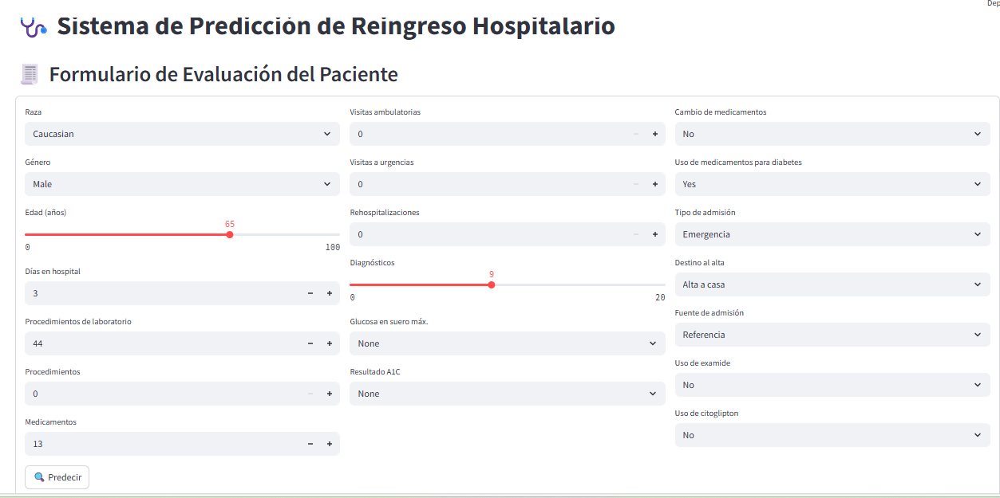

# Proyecto 3 - MLOps (Fase Local)

Este proyecto implementa una arquitectura básica de MLOps de manera local para el procesamiento de datos, entrenamiento y predicción de un modelo de clasificación, utilizando FastAPI y almacenamiento en MySQL.

---

## 📁 Estructura del Proyecto

```text
Proyecto_3/
│
├── app_back/                      # Backend con FastAPI
│   └── main.py                    # Endpoints de carga, procesamiento, entrenamiento y predicción
│
├── app_front/                     # Interfaz Streamlit (opcional)
│   └── app.py
│
├── connections/                   # Configuración de conexión a MySQL (RAW y CLEAN)
│   ├── __init__.py
│   └── mysql_connections.py
│
├── dags/                          # Scripts de procesamiento, carga y entrenamiento (para Airflow)
│   ├── carga_datos.py             # Inserta datos crudos en RAW
│   ├── preprocesar_datos.py       # Procesa datos y los guarda por lotes en CLEAN
│   └── train_model.py             # Entrena modelos por lote, guarda métricas y el mejor modelo
│
├── data/Diabetes/                 # Dataset original
│   └── Diabetes.csv
│
├── mlflow/                        # Configuración de MLflow
│   ├── dockerfile_mlflow          # Dockerfile para servidor MLflow
│   └── requirements_mlflow.txt    # Requerimientos específicos de MLflow
│
├── minio/                         # Carpeta montada por MinIO para almacenamiento S3
│   └── (se llena en tiempo de ejecución)
│
├── models/                        # Modelos serializados entrenados
│   ├── modelo_entrenado_batch1.pkl
│   ├── modelo_entrenado_batch2.pkl
│   ├── modelo_entrenado_batch3.pkl
│   ├── modelo_entrenado_batch4.pkl
│   ├── modelo_entrenado_batch5.pkl
│   ├── modelo_entrenado_batch6.pkl
│   └── modelo_entrenado_final.pkl  # Mejor modelo según métrica definida
│
├── imagenes/                      # Recursos gráficos
│   ├── arquitectura.png
│   └── Front_Streamlit.png
│   └── Airflow.png
│   └── MlFlow.png
│   └── Minio.png
│   └── Arquitectura del proyecto.png
│
│
├── logs/                          # Logs generados por las ejecuciones de Airflow o el sistema
│   └── ...
│
├── plugins/                       # (Opcional) Plugins de Airflow si se usan
│
├── docker-compose.yml            # Orquestación de servicios: Airflow, MLflow, MinIO, MySQL, etc.
├── dockerfile                    # Dockerfile general
├── requirements.txt              # Dependencias globales del proyecto
└── .README.md                     # Documentación del proyecto

```

## ✅ Funcionalidad Actual


- **Carga de datos**  
  Inserta datos crudos en la tabla `initial_data` del esquema `raw_data`.

- **Preprocesamiento**  
  Limpia los datos, elimina columnas irrelevantes, transforma variables categóricas y divide el dataset en conjuntos de `entrenamiento`, `validación` y `prueba`. La siguiente función fue definida para que se tomen los datasets de entrenamiento, validación y prueba generados tras el preprocesamiento, y los almacena en la base de datos `CLEAN_DATA` en tres tablas: `train_data`, `val_data` y `test_data`.

  El dataset de entrenamiento se divide en lotes (`batches`) del tamaño especificado (por defecto 15,000 registros) para permitir un procesamiento más controlado. Cada lote es almacenado en la tabla `train_data` con una columna adicional llamada `batch_id` que indica a qué lote pertenece cada registro.

  #### Código:

  ```bash
  def almacenar_en_clean_data(df_train, df_val, df_test, batch_size=15000, random_state=42):
      try:
          df_train = df_train.sample(frac=1, random_state=random_state).reset_index(drop=True)
          total_batches = ceil(len(df_train) / batch_size)

          for batch_number in range(1, total_batches + 1):
              start = (batch_number - 1) * batch_size
              end = batch_number * batch_size
              df_batch = df_train.iloc[start:end].copy()

              if df_batch.empty:
                  continue

              df_batch["batch_id"] = batch_number
              crear_y_reemplazar_si_existe(df_batch, "train_data", cleandatadb_engine)

          crear_y_reemplazar_si_existe(df_val, "val_data", cleandatadb_engine)
          crear_y_reemplazar_si_existe(df_test, "test_data", cleandatadb_engine)

          print("Carga en CLEAN_DATA completada.")
          return total_batches

      except Exception as e:
          print(f"Error al almacenar en CLEAN_DATA: {e}")
          raise e
  ```
- **Entrenamiento del modelo**  
  Entrena múltiples modelos `RandomForestClassifier` (uno por cada batch) usando `Pipeline` de `scikit-learn`, guarda cada uno como `modelo_entrenado_batch{n}.pkl`, registra sus métricas (`accuracy`, `precision`, `recall`, `f1-score`) en la tabla `clean_data.experiments` y selecciona el mejor modelo basado en `val_f1`, copiándolo como `modelo_entrenado_final.pkl`.

- **Predicción vía API**  
  Utiliza el modelo `modelo_entrenado_final.pkl` para predecir nuevas muestras y guarda las predicciones con sus probabilidades en `raw_data.predictions`.

- **Interfaz gráfica con Streamlit**  
  Permite a los usuarios realizar predicciones desde un formulario web amigable, que se comunica con la API FastAPI para enviar datos y mostrar resultados.

  

- **API REST con FastAPI**  
  Permite ejecutar cada etapa del flujo mediante endpoints:

| Endpoint        | Acción                                                   |
|----------------|----------------------------------------------------------|
| `/download`     | Descarga el dataset e inserta en `raw_data.initial_data` |
| `/clean`        | Preprocesa y divide los datos, luego guarda por lotes    |
| `/train`        | Entrena todos los modelos por lote y selecciona el mejor |
| `/predict`      | Realiza predicciones usando el mejor modelo entrenado    |

- **Airflow**  

Airflow se encarga de orquestar las tareas del flujo ETL y entrenamiento. Se ha implementado con Docker Compose y se compone de los siguientes DAGs:

- `cargar_datos`: descarga un dataset CSV desde Google Drive y lo inserta en MySQL en la Base `ROW_DATA`.
- `preprocesar_datos`: limpia y transforma los datos, y los guarda en la base `CLEAN_DATA`.
- `train_model`: entrena varios modelos por lotes y selecciona el mejor usando `RandomForest`.

  **Configuraciones destacadas**:
- Los DAGs se ejecutan en orden gracias a `ExternalTaskSensor`.
- Se utilizan `PythonOperator` para ejecutar funciones personalizadas.
- Airflow usa MySQL como backend.
- El servicio está expuesto en el puerto `8080`.

  

- **Minio**  
MinIO actúa como almacenamiento tipo S3 para MLflow.

- Se expone la consola de MinIO en el puerto `8083`.
- Se creó un bucket llamado `mlflows3`.
- MLflow puede subir automáticamente modelos `.pkl` y archivos al bucket.
- El servicio está expuesto en el puerto `8083`.

  

- **MlFlow**  

MLflow gestiona el tracking de los experimentos y almacenamiento de modelos. Se configuró de la siguiente forma:

- Usando `mysql` como `backend-store-uri` para guardar metadata de experimentos.
- Usando `MinIO` como almacenamiento de artefactos (`--default-artifact-root s3://mlflows3`).
- Se configuró un contenedor `mlflow_server` en Docker Compose.
- El servicio está expuesto en el puerto `8084`.
- Entra al contenedor de MySQL y ya dentro de la consola de MySQL:

```bash

docker exec -it mysql mysql -u root
contraseña: 
CREATE DATABASE IF NOT EXISTS mlflow;
EXIT;
```
- Nota: Aun esta pendiente configurar para que los experimentos que se realicen con el DAG de entrenamiento almacene los resultados como el modelo. 

  

---

## 🧰 Requisitos y Puesta en Marcha

Sigue estos pasos para ejecutar el proyecto localmente:

```bash
# 1. Clonar el repositorio
git clone git@github.com:JohnSanchez27/MLOPS_Proyectos_3.git
cd MLOPS_Proyectos_3
```