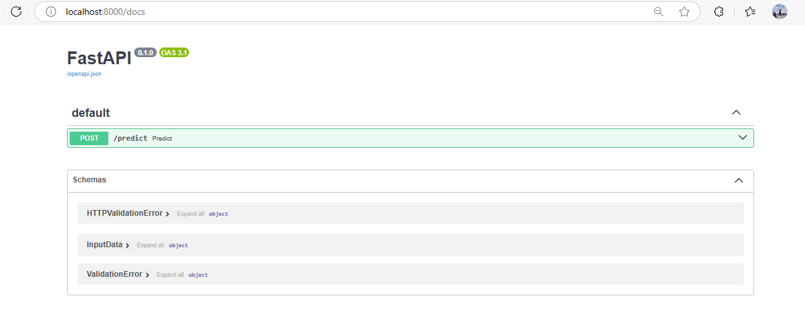
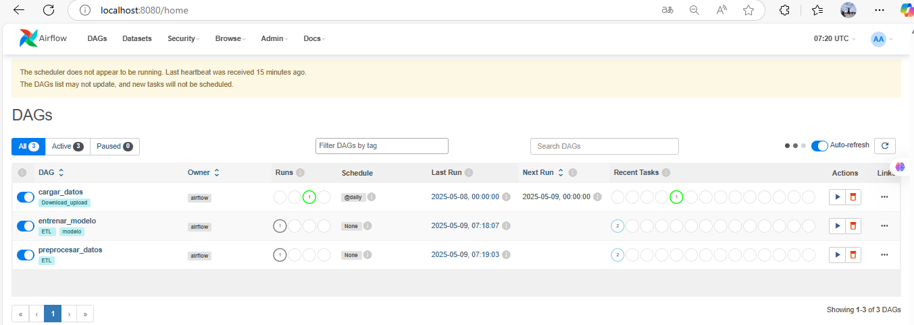
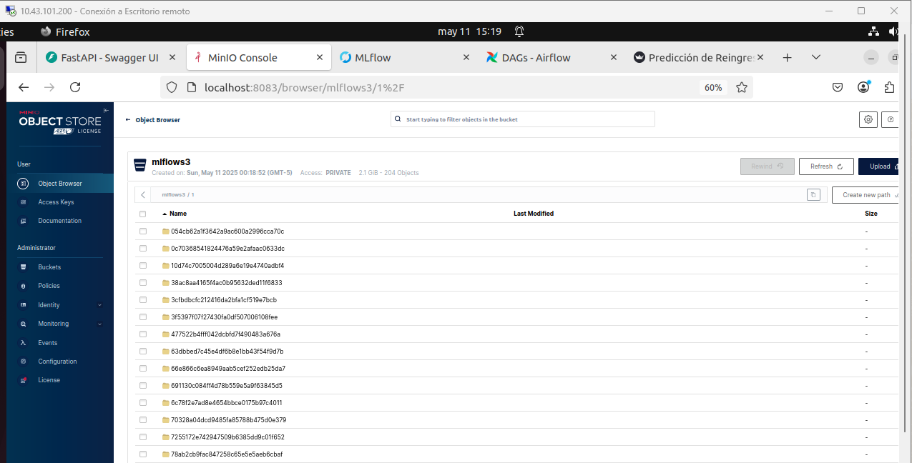
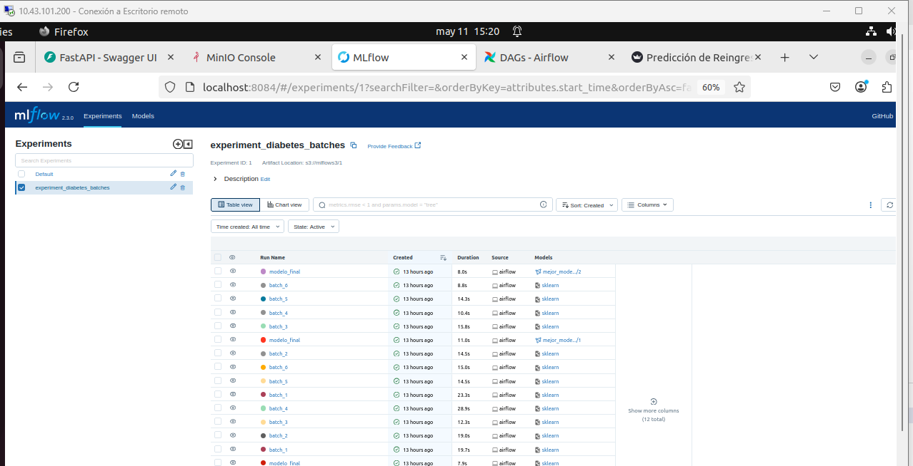

# Proyecto 3 - MLOps (Fase Local)

Este proyecto implementa una solución completa de MLOps que automatiza el proceso de entrenamiento, despliegue y consumo de un modelo de machine learning para predecir la probabilidad de que un paciente sea readmitido en un hospital. Utiliza un enfoque modular basado en contenedores con Docker y herramientas modernas como Apache Airflow, MLflow, MinIO, FastAPI y Streamlit.

  - **Características principales**

        - Automatización del flujo de trabajo de datos con Airflow, desde la carga hasta el entrenamiento por lotes.
        - Entrenamiento de modelos por batch y selección automática del mejor modelo con métricas como F1-score.
        - Registro y versionado de modelos en MLflow y almacenamiento de artefactos en MinIO como backend S3.
        - API REST construida con FastAPI que permite servir el modelo en producción.
        - Interfaz de usuario interactiva desarrollada con Streamlit para simular casos de pacientes y consumir el modelo.
        - Persistencia de predicciones en base de datos MySQL para trazabilidad y análisis posterior.
        - Contenerización de todos los servicios mediante Docker Compose para fácil orquestación y despliegue local.

---

## 📁 Estructura del Proyecto

```text
Proyecto_3/
│
├── app_back/                              # Backend con FastAPI
│   ├── main.py                            # Endpoints de predicción conectados a MLflow y MySQL
│   ├── dockerfile_api.py                  # Dockerfile de la API FastAPI
│   └── requirements_api.txt               # Dependencias de FastAPI
│
├── app_front/                             # Interfaz de usuario con Streamlit
│   ├── app.py                             # App de Streamlit para ingresar datos y consumir la API
│   ├── dockerfile_app.py                  # Dockerfile para la interfaz de usuario
│   └── requirements_app.txt               # Dependencias de Streamlit
│
├── connections/                           # Configuración de conexión a bases de datos MySQL
│   ├── __init__.py
│   └── mysql_connections.py
│
├── dags/                                  # Scripts usados por Apache Airflow
│   ├── carga_datos.py                     # Inserta datos crudos en base RAW
│   ├── preprocesar_datos.py               # Procesa los datos y los guarda por lotes en CLEAN
│   └── train_model.py                     # Entrena modelos, guarda métricas, y registra el mejor en MLflow
│
├── data/Diabetes/                         # Dataset original
│   └── Diabetes.csv
│
├── mlflow/                                # Configuración del servidor MLflow
│   ├── dockerfile_mlflow                  # Dockerfile para MLflow
│   ├── init.sql                           # Script de inicialización de base de datos para MLflow
│   └── requirements_mlflow.txt            # Requerimientos específicos para MLflow
│
├── minio/                                 # Carpeta montada por MinIO para almacenar artefactos de MLflow
│   └── (se llena en tiempo de ejecución)
│
├── models/                                # Modelos entrenados y serializados
│   ├── modelo_entrenado_batch1.pkl
│   ├── modelo_entrenado_batch2.pkl
│   ├── modelo_entrenado_batch3.pkl
│   ├── modelo_entrenado_batch4.pkl
│   ├── modelo_entrenado_batch5.pkl
│   ├── modelo_entrenado_batch6.pkl
│   └── modelo_entrenado_final.pkl         # Mejor modelo identificado y registrado en MLflow
│
├── imagenes/                              # Recursos gráficos para documentación
│   ├── arquitectura.png
│   ├── Front_Streamlit.png
│   ├── Airflow.png
│   ├── MlFlow.png
│   ├── Minio.png
│   └── Arquitectura del proyecto.png
│
├── logs/                                  # Logs generados por Airflow y el sistema
│   └── ...
│
├── plugins/                               # (Opcional) Plugins de Airflow si se utilizan
│
├── docker-compose.yml                     # Orquestación de servicios: Airflow, MLflow, MinIO, MySQL, etc.
├── dockerfile                             # Dockerfile base del entorno
├── requirements.txt                       # Dependencias globales del proyecto
└── README.md                              # Documentación del proyecto

```

## ✅ Funcionalidad Actual


- **Carga de datos**  
  La etapa de carga de datos del proyecto se encarga de descargar automáticamente el conjunto de datos original desde una URL externa (específicamente desde Google Drive) y almacenarlo en la base de datos RAW_DATA. El archivo solo se descarga si no existe previamente en el directorio local ./data/Diabetes, y se valida que no esté vacío antes de procesarlo. Si las bases de datos RAW_DATA y CLEAN_DATA no existen, son creadas automáticamente mediante SQLAlchemy. Posteriormente, los datos se insertan en la tabla initial_data del esquema RAW_DATA. Si la tabla no existe, se crea con base en la estructura del archivo CSV; si ya existe, su contenido se limpia antes de insertar los nuevos registros. Todo este flujo es gestionado por dos DAGs de Airflow: uno que verifica y crea las bases de datos (crear_bases_si_no_existen) y otro que realiza la descarga e inserción del archivo (cargar_datos). Esto garantiza un proceso de ingesta robusto, automatizado y preparado para actualizaciones diarias.

- **Preprocesamiento**

  La etapa de preprocesamiento transforma los datos crudos almacenados en la tabla initial_data de la base RAW_DATA en un conjunto de datos limpio, estructurado y dividido en subconjuntos para entrenamiento, validación y prueba. Este proceso incluye la eliminación de columnas irrelevantes o con muchos valores nulos, la imputación de valores faltantes con la moda de cada categoría, el reemplazo de valores inconsistentes, la transformación de edades de rangos a valores numéricos y la recodificación de variables categóricas como tipo de admisión, alta y fuente de ingreso. Además, se eliminan registros con género no válido y columnas identificadoras como encounter_id y patient_nbr. Luego, los datos se dividen usando train_test_split y se almacenan en la base CLEAN_DATA en tres tablas: train_data, val_data y test_data. La tabla train_data se divide en lotes identificados con una columna batch_id para permitir un entrenamiento por etapas. Todo este flujo es orquestado por el DAG de Airflow preprocesar_datos, que ejecuta automáticamente estas tareas al ser invocado

  #### Código:

  ```bash
  def almacenar_en_clean_data(df_train, df_val, df_test, batch_size=15000, random_state=42):
      try:
          df_train = df_train.sample(frac=1, random_state=random_state).reset_index(drop=True)
          total_batches = ceil(len(df_train) / batch_size)

          for batch_number in range(1, total_batches + 1):
              start = (batch_number - 1) * batch_size
              end = batch_number * batch_size
              df_batch = df_train.iloc[start:end].copy()

              if df_batch.empty:
                  continue

              df_batch["batch_id"] = batch_number
              crear_y_reemplazar_si_existe(df_batch, "train_data", cleandatadb_engine)

          crear_y_reemplazar_si_existe(df_val, "val_data", cleandatadb_engine)
          crear_y_reemplazar_si_existe(df_test, "test_data", cleandatadb_engine)

          print("Carga en CLEAN_DATA completada.")
          return total_batches

      except Exception as e:
          print(f"Error al almacenar en CLEAN_DATA: {e}")
          raise e
  ```
- **Entrenamiento del modelo** 

  La etapa de entrenamiento se encarga de construir modelos de predicción utilizando los datos procesados y almacenados previamente en la base CLEAN_DATA. Para ello, se entrena un modelo RandomForestClassifier por cada lote (batch_id) presente en la tabla train_data, utilizando un pipeline de preprocesamiento que normaliza las variables numéricas con StandardScaler y codifica las variables categóricas con OneHotEncoder. Cada modelo se evalúa utilizando métricas de desempeño (precisión, recall, f1-score y accuracy) sobre los conjuntos de validación y prueba (val_data y test_data), y sus resultados se registran en la tabla experiments en la base de datos. Además, se serializa cada modelo por lote y se guarda como artefacto en MLflow. Finalmente, se selecciona automáticamente el mejor modelo según la métrica val_f1, se guarda con el nombre modelo_entrenado_final.pkl, se registra oficialmente en el Model Registry de MLflow con el nombre mejor_modelo_diabetes, y se promueve al stage de Production para ser consumido desde una API. Todo este proceso es gestionado automáticamente por el DAG entrenar_modelo de Airflow.

- **Predicción vía API** 

  Esta etapa corresponde al despliegue del modelo a producción mediante una API construida con FastAPI. El archivo expuesto configura una aplicación backend que permite recibir datos de pacientes, realizar predicciones sobre su posible reingreso hospitalario y registrar los resultados en una base de datos. Al iniciar, la API se conecta al servidor de MLflow y al repositorio de artefactos en MinIO para cargar la versión del modelo en estado Production, registrado previamente como mejor_modelo_diabetes. La clase InputData define el esquema de entrada validado mediante Pydantic, y el endpoint /predict expone el modelo a solicitudes HTTP POST. Cuando se recibe una solicitud, los datos del paciente son transformados en un DataFrame, enviados al modelo para predecir si el paciente será readmitido, y, si el modelo lo permite, se calcula además la probabilidad de reingreso. Los resultados, junto con la predicción y la marca de tiempo, se almacenan en la tabla predictions del esquema RAW_DATA. Esta solución convierte el modelo en un servicio accesible para integraciones externas o herramientas de visualización como Streamlit.

  - **API REST con FastAPI**  
      Permite ejecutar cada etapa del flujo mediante endpoints y el servicio está expuesto en el puerto `8080`. 
      http://10.43.101.200:8000/docs

        | Endpoint        | Acción                                                   |
        |----------------|----------------------------------------------------------|
        | `/predict`      | Realiza predicciones usando el mejor modelo entrenado    |

    

- **Interfaz gráfica con Streamlit**  
  la interfaz de usuario desarrollada con Streamlit, diseñada para interactuar fácilmente con el modelo de predicción de reingreso hospitalario. Desde el navegador, el usuario puede ingresar manualmente información clínica y demográfica del paciente mediante un formulario distribuido en tres columnas que agrupa variables como edad, género, diagnósticos, visitas médicas y características de admisión. Al enviar el formulario, los datos son empaquetados en formato JSON y enviados a un endpoint expuesto por la API FastAPI.

  La respuesta del modelo es procesada de inmediato: muestra si el paciente será readmitido (Readmitido o No Readmitido), e incluye la probabilidad estimada de reingreso si el modelo lo permite. Adicionalmente, si la API devuelve información sobre el nombre y la versión del modelo cargado desde MLflow, estos datos también se muestran en la interfaz para mayor transparencia. Esta aplicación mejora la experiencia del usuario final al proporcionar un acceso claro, interactivo y visualmente amigable al sistema de predicción desplegado en producción.

  el servicio está expuesto en el puerto `8501`. 
  http://10.43.101.200:8501

  

- **Airflow**  

Airflow se encarga de orquestar el flujo completo del proceso y el entrenamiento de modelos. Se ha implementado mediante Docker Compose y está conformado por los siguientes DAGs:

  * cargar_datos: descarga un archivo CSV desde Google Drive y lo inserta en la base de datos RAW_DATA de MySQL.
  * preprocesar_datos: realiza la limpieza y transformación de los datos, y los almacena por lotes en la base CLEAN_DATA.
  * train_model: entrena múltiples modelos por lote utilizando RandomForestClassifier y selecciona automáticamente el mejor según la métrica val_f1 registrándolo en MLflow.

El servicio de Airflow está expuesto en el puerto 8080, accesible desde la siguiente URL: http://10.43.101.200:8080/home

  


- **Minio**  
#


MinIO funciona como un servicio de almacenamiento tipo S3 compatible, utilizado por MLflow para guardar modelos entrenados y otros artefactos.

  * Se ha configurado un bucket llamado mlflows3, donde MLflow almacena automáticamente modelos .pkl y archivos asociados a cada experimento.
  * La consola web de MinIO está disponible en el puerto 8083 y permite visualizar los objetos almacenados.

El servicio está disponible en: http://10.43.101.200:8083

  

- **MlFlow**  

MLflow se encarga de gestionar el seguimiento de experimentos (tracking), almacenamiento de métricas, parámetros, artefactos y versiones de modelos.

  * Se configuró el contenedor mlflow_server en Docker Compose.
  * Utiliza MySQL como backend-store-uri para guardar la metadata de los experimentos.
  * Emplea MinIO como almacenamiento de artefactos, usando el bucket mlflows3 (--default-artifact-root s3://mlflows3).
  * El servicio de MLflow está expuesto en el puerto 8084 y se puede acceder desde:   http://10.43.101.200:8084
  * Se incluyó un archivo init.sql para inicializar la base de datos solo cuando el volumen de MySQL está vacío, asegurando una configuración idempotente del entorno.
    ```
    -- ./mysql-init/init.sql
    CREATE DATABASE IF NOT EXISTS mlflow;
    ```
  
---

## 🛠️ Puesta en Marcha del Proyecto

Esta sección describe los pasos necesarios para levantar todo el ecosistema del sistema de predicción de readmisión hospitalaria en un entorno local mediante Docker Compose.

### 1. Clonar el Repositorio

```bash
    git clone https://github.com/tu-usuario/proyecto_3.git
    cd proyecto_3
```

### 2 . Verificar Archivos .env y Variables

Asegúrese de que las siguientes variables estén bien definidas en el entorno o dentro del docker-compose.yml:
```bash
    export MLFLOW_S3_ENDPOINT_URL=http://minio:9000
    export AWS_ACCESS_KEY_ID=admin
    export AWS_SECRET_ACCESS_KEY=supersecret
```
### 3. Levantar los Servicios
Ejecuta el siguiente comando para construir y levantar todos los servicios:
```bash
    docker-compose up --build -d
```
Esto desplegará los siguientes contenedores:

  * Airflow (Scheduler, Webserver, Worker, Triggerer, Init)
  * MySQL
  * MinIO
  * MLflow
  * FastAPI (Backend de predicción)
  * Streamlit (Frontend para usuarios)

### 4.  Ejecutar los DAGs en Airflow

Para ejecutar el pipeline completo:

- Ingresa a la interfaz de Airflow: http://10.43.101.200:8080
- Activa y ejecuta los DAGs en el siguiente orden:

  * Primero activa y lanza el DAG crear_bases_si_no_existen.
  * Luego, ejecuta el DAG cargar_datos.
  * Después, ejecuta preprocesar_datos.
  * Finalmente, ejecuta entrenar_modelo para entrenar y registrar el mejor modelo.

Esto descargará el dataset, lo insertará en la base RAW_DATA, realizará la transformación y lo almacenará en CLEAN_DATA. Luego entrenará modelos por lote, evaluará y seleccionará el mejor, registrándolo automáticamente en MLflow.

### 5. Uso del Sistema

Una vez entrenado el modelo y cargado en MLflow, puedes hacer predicciones desde: Streamlit: desde una interfaz gráfica en http://localhost:8501, simulando pacientes y visualizando la probabilidad de readmisión.


## ✅ Despliegue con kubernetes

